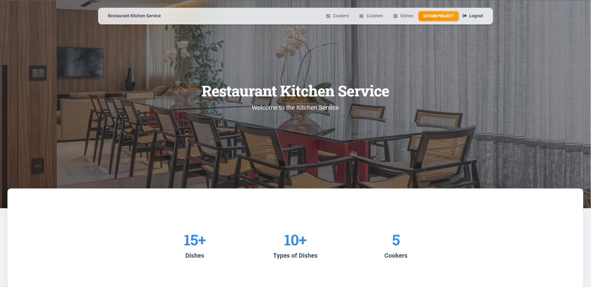

# Restaurant Kitchen Service

Django project for managing cookers and dishes in Kitchen Service

## Check it out!

[Kitchen Service project deployed to Render](https://kitchen-service-hrsy.onrender.com)

Use it for login:

Login: user

Password: user1234

## Installation

```shell
git clone https://github.com/Yevheniy-Lototskiy/restaurant-kitchen-service.git
cd kitchen
python -m venv venv
venv\Scripts\activate (on Windows)
source venv/bin/activate (on macOS)
python manage.py migrate
python manage.py runserver
```

## Features

* Authentication functionality for Cooker/User
* Managing dishes cookers & cuisines directly from interface
* Powerful admin panel for advanced managing

## Screenshot


